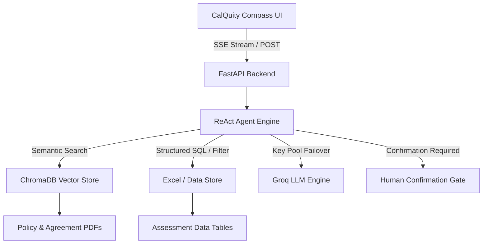

# ParcelPilot · Compass Support Copilot

[](https://parcelpilot-agent-production.up.railway.app/showcase)
[](https://github.com/Sumitboii/-parcelpilot-agent)
[](https://groq.com)

---

### 🌐 **Live Interactive Application**
👉 **[https://parcelpilot-agent-production.up.railway.app/showcase](https://parcelpilot-agent-production.up.railway.app/showcase)**

*No installation or login required. Features full multi-step reasoning, CalQuity Compass cards, and instant query execution.*

---

## 🌟 What It Does

**ParcelPilot Compass** is an internal AI copilot built for Customer Support Agents and Customer Success Managers (CSMs). Internal staff can ask plain-language questions regarding orders, tickets, contracts, and policy edge cases.

The agent orchestrates multi-step reasoning across **6 source documents** and structured data tables, generates precision citations, and strictly enforces the **Source-Authority Hierarchy** — even when historical ticket records are misleading.

### Key Capabilities:
- ⚡ **CalQuity Compass UI**: Live execution metrics, step spinners, checkmarks, and source citation badges (`↳`).
- 🔄 **Hierarchy-Aware RAG**: Automatically prioritizes signed customer enterprise agreements (e.g. *Northstar Enterprise Agreement §2*) over generic company SOPs.
- 🚫 **Deprecation Filter**: Actively rejects deprecated policies (*Support Policy v2*) in favor of current authoritative standards (*Support Policy v3*).
- 🛡️ **Human-in-the-Loop Confirmation**: Requires explicit staff confirmation before dispatching P1 incident escalations.
- 👥 **Role-Based Access Control (RBAC)**: Role switcher for Support Agents (`Rohit`, `Maya`) vs CSMs (`Priya Mehta`, `Arjun Rao`, `Neha Kapoor`).
- 🚨 **Proactive Live Issues Sweep**: Real-time monitoring sidebar for SLA breaches, approaching breaches, and Known Issue (KI) correlations.
- 🔁 **Groq Multi-Key Pool**: Resilient failover pool that instantly rotates API keys on rate limits.

---

## 🧭 Live Demo Showcase

Try these scenarios directly in the **[Live Showcase](https://parcelpilot-agent-production.up.railway.app/showcase)**:

| Scenario | What the Agent Does | Correct Resolution |
|---|---|---|
| **Northstar Cancellation** | Prioritizes *Northstar Enterprise Agreement §2* | **No cancellation fee** (Overrides SOP 30-min rule and wrong TKT-450) |
| **LumenWorks CSV Limit** | Distinguishes product limit vs known issue | **5,000 row limit**; KI-208 workaround is 3,000 rows (Overrides wrong TKT-451) |
| **SwiftShip BOOKED Delay** | Surfaces KI-211 webhook delay | Informs customer pickup occurred but webhook can take up to 20m |
| **ORD-2002 Credit** | Applies custom agreement calculation | **INR 300 fixed credit** / 4h threshold (Not SOP default) |
| **TKT-505 Axis Labs P1** | Enforces 30-min Enterprise SLA & Confirmation | Triggers **Interactive Confirmation Card** before escalating |

---

## 🏗️ Architecture



---

## 🛠️ Stack

| Layer | Choice |
|---|---|
| **LLM Engine** | Groq (`openai/gpt-oss-120b` / `openai/gpt-oss-20b`) with Multi-Key Pool |
| **Agent Core** | Hand-rolled Python ReAct tool router (no LangChain lock-in) |
| **RAG Store** | ChromaDB + `sentence-transformers/all-MiniLM-L6-v2` |
| **Backend API** | FastAPI + SSE streaming + Pydantic v2 |
| **Frontend** | CalQuity Compass UI (Vanilla JS + Inter font) & React 18 + Tailwind |
| **Cloud Hosting** | Railway (`https://parcelpilot-agent-production.up.railway.app`) |

---

## 🚀 Running Locally

### 1. Prerequisites
- Python 3.10+
- Free [Groq API Key](https://console.groq.com)

### 2. Clone and Setup
```bash
git clone https://github.com/Sumitboii/-parcelpilot-agent.git
cd -parcelpilot-agent

# Create virtual environment
python -m venv venv
venv\Scripts\activate  # On Linux/macOS: source venv/bin/activate

# Install dependencies
pip install -r requirements.txt
```

### 3. Environment Variables
Copy `.env.example` to `.env`:
```bash
cp .env.example .env
```
Add your Groq API key:
```env
GROQ_API_KEY=gsk_your_groq_key_here
```

### 4. Start Backend Server
```bash
uvicorn backend.main:app --host 0.0.0.0 --port 8000 --reload
```
Open **`http://localhost:8000/showcase`** in your browser.

---

## 🧪 Testing

The repository includes a comprehensive 60-test suite covering data loaders, RAG search, RBAC, confirmation gates, and evaluation matrices:

```bash
pytest tests/ -v
```
*(All 60 tests pass with 100% success rate).*

---

## 📜 License
MIT License. Created for the ParcelPilot Assessment.
